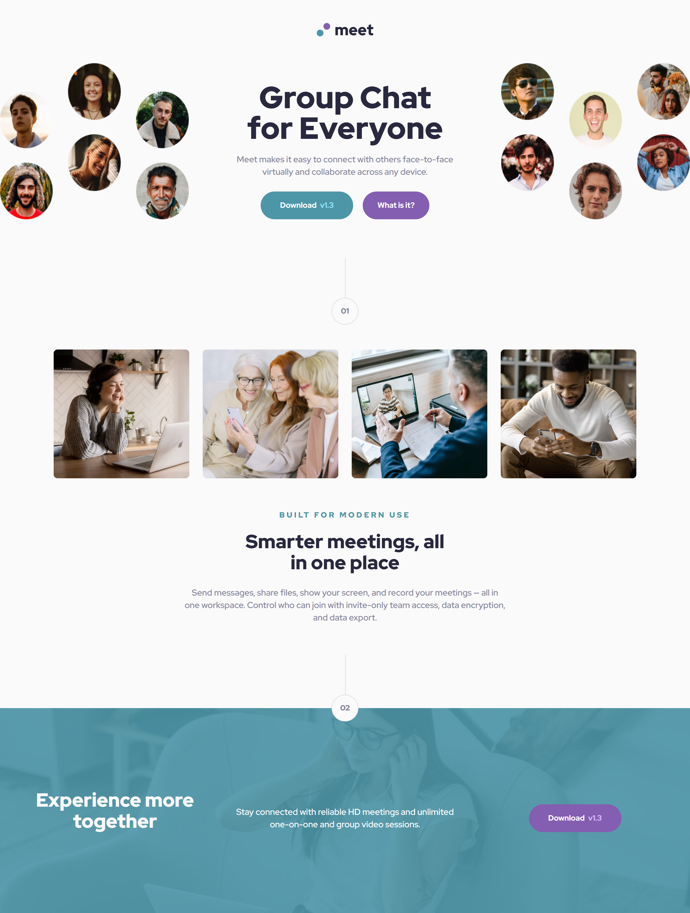

# Frontend Mentor - Meet landing page solution

This is a solution to the [Meet landing page challenge on Frontend Mentor](https://www.frontendmentor.io/challenges/meet-landing-page-rbTDS6OUR),
which was asign to me by my mentor. This to test my knowledge on responsive design with flex-box, media querry and CSS preprocessor `"SASS"`. 

## Table of contents

- [Overview](#overview)
  - [The challenge](#the-challenge)
  - [Screenshot](#screenshot)
  - [Links](#links)
- [My process](#my-process)
  - [Built with](#built-with)
  - [What I learned](#what-i-learned)
  - [Useful resources](#useful-resources)
- [Author](#author)

## Overview

### The challenge

Users should be able to:

- View the optimal layout depending on their device's screen size
- See hover states for interactive elements

### Screenshot

### Links

- Solution URL: [Add solution URL here](https://adeolaking.github.io/meet-landing-page/)
- Live Site URL: [Add live site URL here](https://adeolaking.github.io/meet-landing-page/)

## My process

  :heavy_check_mark: i structured and styled the `HTML` AND `CSS`\

### Built with

- Semantic HTML5 markup
- CSS3
- Flexbox
- mediaQuerry
- SASS/SCSS
- Mobile-first workflow

### What I learned

:heavy_check_mark: in this project i practice web resposiveness using `flex-box` and `mediaQuerry`\

:heavy_check_mark: i practice Writting clean simplified and clean styles with ` The SASS CSS Syntax`\
:heavy_check_mark: how to use `SASS Parcials`\
:heavy_check_mark: \

### Useful resources

## Author

- Frontend Mentor - [@GStormx2](https://www.frontendmentor.io/profile/GStormx2)

